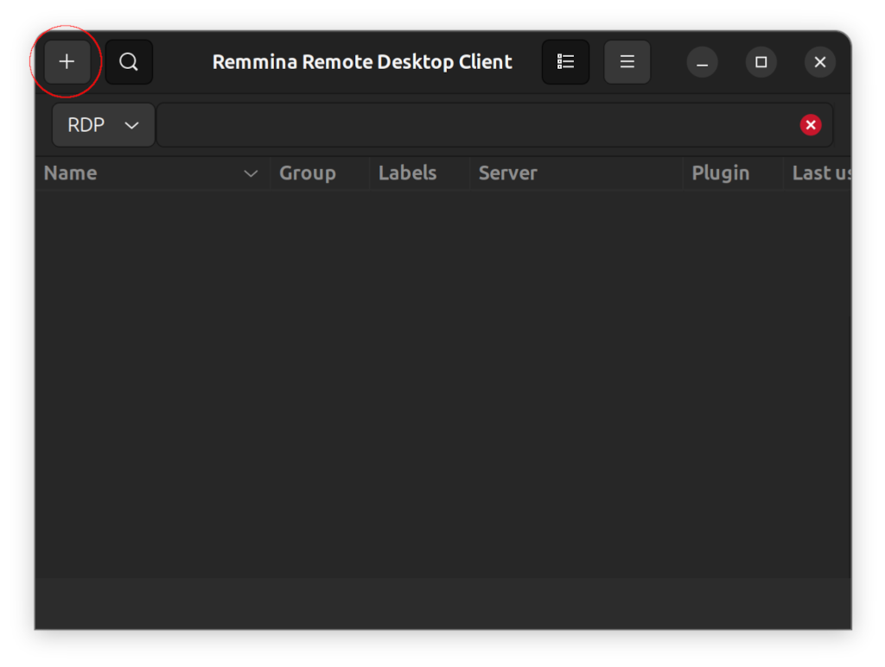
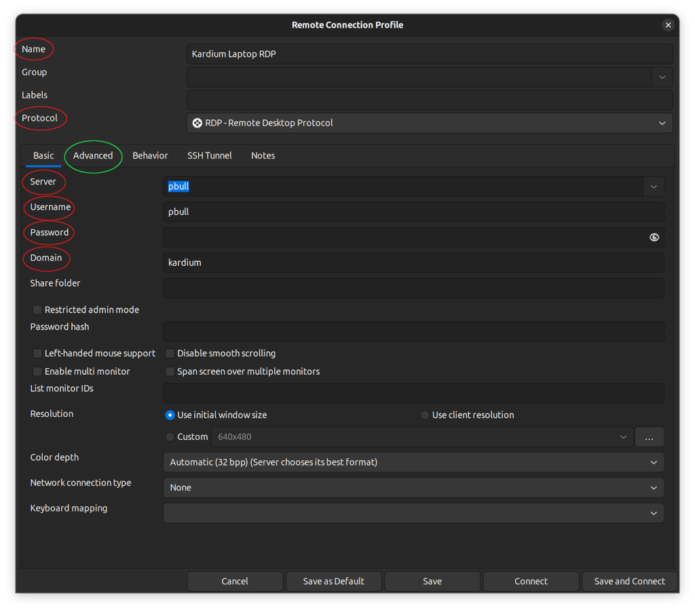
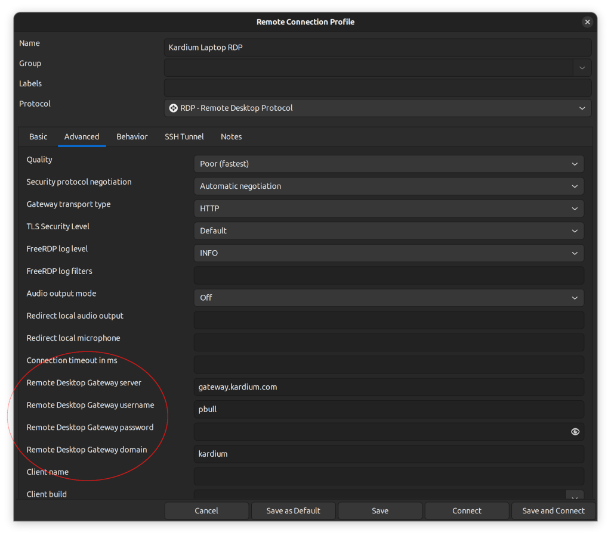

# Remmina
Remote desktop software for Linux; can remote into Windows machines.

Recommendation courtesy of Phil.

## Notes
Remmina and VirtualBox both capture right-ctrl for exiting out.
So using VirtualBox in Remmina means you can never exit the VirtualBox machine
as Remmina captures the key first.

The simple workaround is to just rebind the "exit capture" key in VirtualBox.

File -> Preferences -> Input -> Virtual Machine tab -> Host Key Combination

## Setup
Step 1 - Launch Remmina and click on the "+" to setup a new connection

Step 2 - In the setup window enter a name for the connection (can  be anything) and select RDP as the protocol. "Server" is the name of your machine (without the kardium.local extension), Username is your username, Password is your password (or leave it blank if you want to be prompted every time) and Domain is Kardium 

Step 3 - For Remote Desktop Gateway Server enter "gateway.kardium.com" and then for Username, Password and Domain, enter the same values as Step 2. Cick "Save and Connect" and it should work

## Troubleshooting
### Audio not being forwarded
* In remote configuration, edit -> Advanced -> Audio output mode: local
* Under edit -> Advanced -> Redirect local audio output: `sys:pulse,format:1`
  * Shoutout to [this post from @argonautical](https://gitlab.com/Remmina/Remmina/-/issues/3361#note_2539153964)
